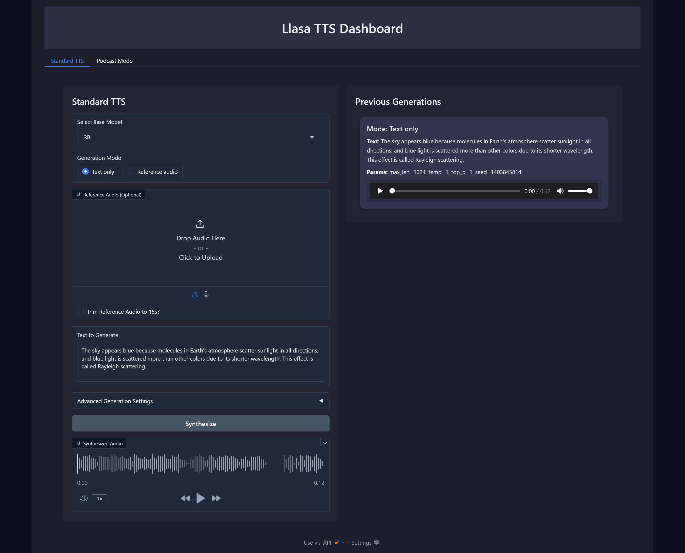
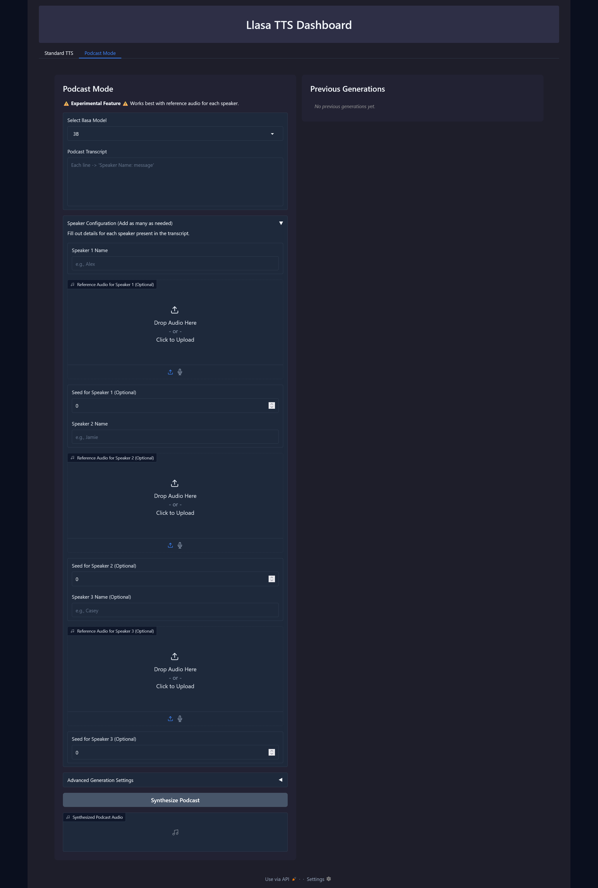

# Llasa TTS Dashboard
A powerful, local text-to-speech system powered by **Llasa TTS** models. This project offers a modern, interactive dashboard that supports multiple model sizes (1B, 3B, and 8B) and introduces a new **Podcast Mode** for multi-speaker conversation synthesis.



---

## Overview
The **Llasa TTS Dashboard** transforms traditional text-to-speech pipelines into a robust, user-friendly application. With efficient GPU utilization, and flexible generation controls, the dashboard is designed for both developers and end users who demand high-quality speech synthesis.

### Key Features
-  **Multi-Model Support**

Switch easily between **1B**, **3B**, and **8B** models.

-  **Standard TTS Mode**

Generate natural-sounding speech either from plain text or with a reference audio prompt.

-  **Podcast Mode**

Create multi-speaker podcasts from transcripts. Configure reference audio and seeds for each speaker to produce consistent character voices.

-  **Advanced Generation Controls**

Fine-tune parameters such as max length, temperature, and top-p. Use random or fixed seeds for reproducibility.

-  **Clean & Modern UI**

A sleek, two-panel interface built with Gradio. Enjoy a dark theme that enhances readability.

---
## System Requirements

-  **Python 3.10+**
-  **CUDA-Capable NVIDIA GPU**

-  **VRAM Requirements:**
-  **8.5 GB+ VRAM:** When running with Whisper Large Turbo in 4-bit mode.
-  **6.5 GB+ VRAM:** When running without Whisper and using the LLM in 4-bit mode.
---

## Installation

### Clone the Repository

```bash

git  clone  https://github.com/nivibilla/local_llasa_tts.git

cd  local_llasa_tts

```
### Setup the Environment

**If you're on Windows, this works best when using WSL2.**
Install the necessary dependencies:

```bash

pip  install  -r  requirements_base.txt

pip  install  -r  requirements_native_hf.txt

```
---

## Usage

You can start the application in several ways:

### Run via Module

From the project root directory, execute:

```bash

python  -m  src.main

```

### Using Provided Scripts

-  **Unix/Linux/Mac:**

Make sure `run.sh` is executable and run it:

```bash

chmod +x run.sh

./run.sh

```

-  **Windows:**

Double-click `run.bat` or run it from the command prompt:

```batch

run.bat

```

### Dashboard Modes

#### Standard TTS Mode

-  **Model Selection:** Choose between 1B, 3B, or 8B.

-  **Generation Mode:** Select "Text only" or "Reference audio."

-  **Advanced Settings:** Adjust max length, temperature, and top-p.

-  **Output:** Listen to the synthesized speech and review previous generations.

#### Podcast Mode

-  **Transcript Input:** Enter a conversation transcript with each line formatted as `Speaker Name: message`.

-  **Speaker Configuration:** Optionally provide reference audio and seeds for each speaker.

-  **Advanced Settings:** Configure generation parameters similar to Standard TTS.

-  **Output:** Generate a complete podcast audio file with seamless transitions.
 
*Screenshot:*



---
## Additional Resources

  

-  **Long Text Inference:**

Refer to [llasa_vllm_longtext_inference.ipynb](./llasa_vllm_longtext_inference.ipynb) for handling long text inputs using VLLM and chunking.

-  **Google Colab:**

If you do not have a suitable local GPU, try our [Colab Notebook](https://colab.research.google.com/github/YourUser/local_llasa_tts/blob/main/colab_notebook_4bit.ipynb).

---

## Acknowledgements

-  **Original LLaSA Training Repository:** Inspired by [zhenye234/LLaSA_training](https://github.com/zhenye234/LLaSA_training).

-  **Gradio Demo Inspiration:** UI concepts adapted from [mrfakename/E2-F5-TTS](https://huggingface.co/spaces/mrfakename/E2-F5-TTS).
